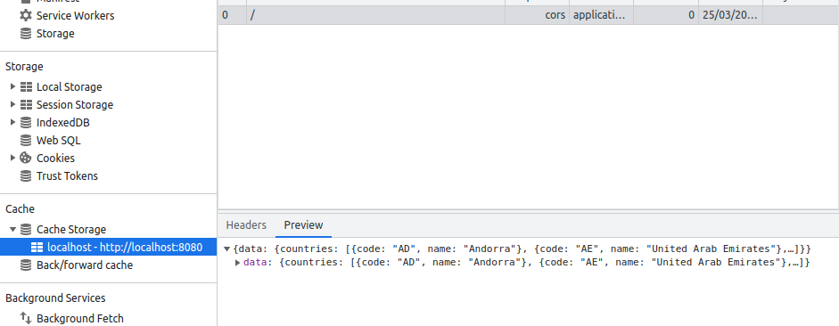

## SW - Service worker [POC]

This is an proof of concept for service workers implentation.

This implementations is a list of countries get from a graphql API in the internet where the
api call's using basiclly vanilla javascript, fetch API. The fetch calls are intercepted from service worker then saving up network requests.

## Local run

Install using `npm` our `yarn`

```bash
  yarn install
```
Then you can run the project with:

```bash
  yarn dev
```

Then the server is hosted in [http://localhost:8080](http://localhost:8080)


## Conclusions

Open the devtools in your browser and select the network tab. In this tab can you see the api call's. The image below describes 2 calls, The first call is an network call (205ms) and the seconde an (ServieWorker) cached response (2ms).


In devtools Application tab you can observe the cached results like the image below:

